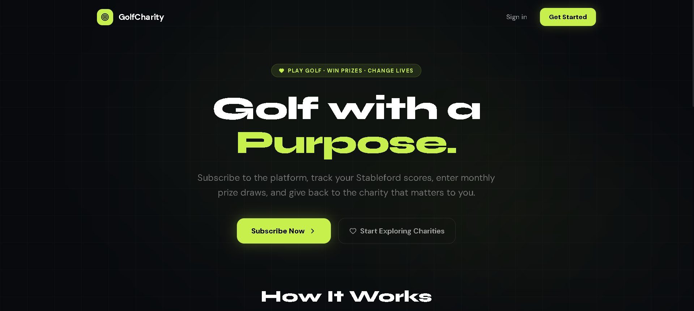
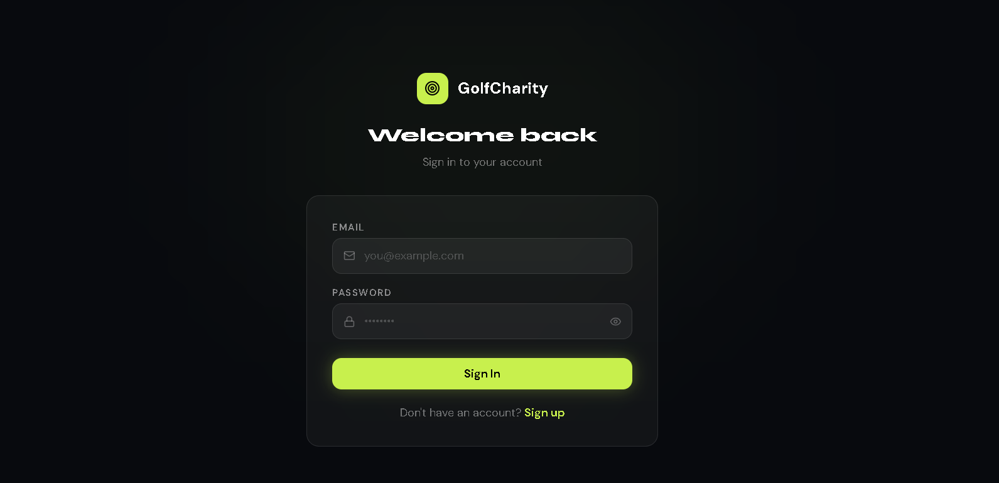
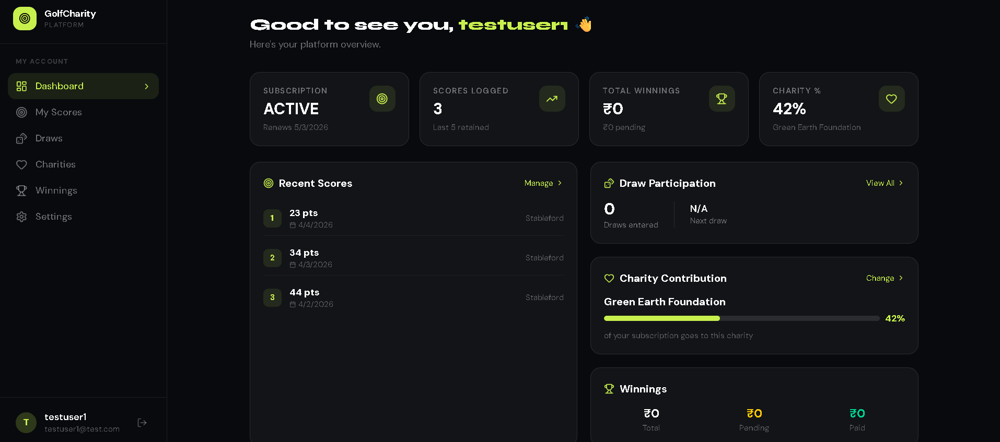
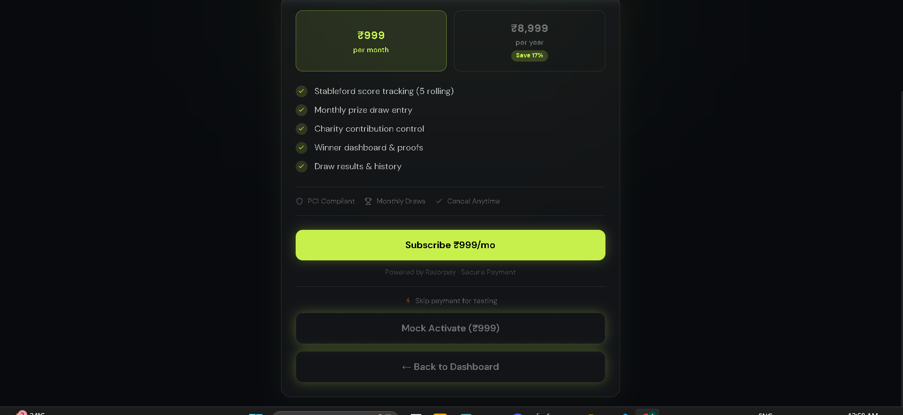
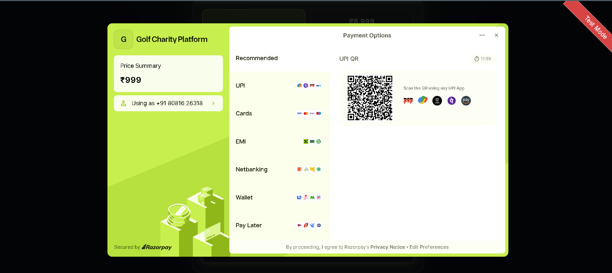
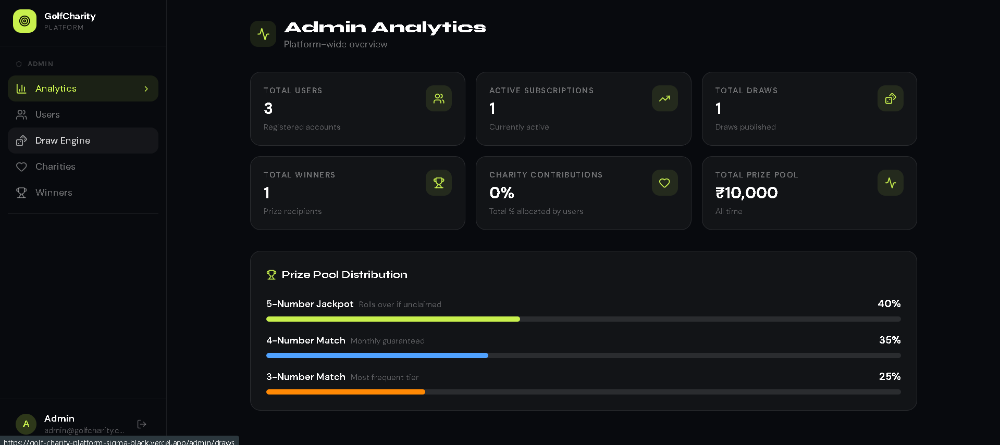

# ⛳ GolfCharity Platform

> **Play Golf · Win Prizes · Change Lives**

A full-stack subscription-based web application that combines Stableford golf score tracking, monthly prize draws, and charitable giving — built for the Digital Heroes Full-Stack Development Trainee Selection.

🌐 **Live Demo:** [golf-charity-platform-sigma-black.vercel.app](https://golf-charity-platform-sigma-black.vercel.app)
🔌 **API:** [golf-charity-platform-fdny.onrender.com](https://golf-charity-platform-fdny.onrender.com)

---

## 📸 Screenshots

### Homepage


_"Golf with a Purpose" — emotion-driven landing page, deliberately avoiding traditional golf aesthetics_

### Login


_Clean dark-themed authentication with JWT httpOnly cookie session management_

### User Dashboard


_Personalised dashboard showing subscription status, recent scores, draw participation, charity contribution, and winnings_

### Subscription & Payment


_Monthly (₹999) and Yearly (₹8,999) plans with live Razorpay integration — UPI, Cards, Netbanking, EMI, Wallets_

### Razorpay Checkout


_Full Razorpay payment modal with UPI QR, Cards, EMI, Netbanking, Wallets and Pay Later_

### Admin Analytics


_Admin dashboard with platform-wide analytics, prize pool distribution visualisation and draw engine controls_

---

## ✨ Features

### For Subscribers

- 🔐 Secure email/password auth with JWT httpOnly cookies
- 📊 Stableford score tracking — rolling window of last 5 scores (1–45 range)
- 🎰 Automatic monthly prize draw entry based on scores
- 💚 Select a charity and control your contribution percentage (min 10%)
- 🏆 View winnings, upload proof, track payout status
- 💳 Subscribe via Razorpay — UPI, Cards, Netbanking, EMI, Wallets, Pay Later

### For Admins

- 👥 Full user management — view profiles, edit scores, manage subscriptions
- 🎲 Draw engine — simulate draws before publishing, choose Random or Weighted algorithm
- 📈 Platform analytics — total users, active subscriptions, prize pool, charity contributions
- 🏛️ Charity CRUD — add, edit, delete, feature charities
- ✅ Winner verification — approve/reject proof submissions, mark payouts as paid

---

## 🏗️ Tech Stack

| Layer               | Technology                              |
| ------------------- | --------------------------------------- |
| **Frontend**        | React 18 + TypeScript + Vite            |
| **Styling**         | Tailwind CSS v4 + shadcn/ui             |
| **HTTP Client**     | Axios with proxy (dev) / env URL (prod) |
| **Backend**         | Node.js + Express + TypeScript          |
| **ORM**             | Prisma 7 with `@prisma/adapter-pg`      |
| **Database**        | PostgreSQL via Supabase                 |
| **Auth**            | JWT + bcryptjs + httpOnly cookies       |
| **Payments**        | Razorpay (UPI, Cards, EMI, Netbanking)  |
| **Frontend Deploy** | Vercel                                  |
| **Backend Deploy**  | Render                                  |

---

## 🗃️ Database Schema

```
users               → auth, roles (SUBSCRIBER / ADMIN)
subscriptions       → plan, status, Razorpay IDs, period end
golf_scores         → score (1–45), datePlayed, userId
charities           → name, description, imageUrl, featured
charity_contributions → userId, charityId, percentage (min 10%)
draws               → month, year, winningNumbers[], prizePool, status, algorithm
draw_entries        → snapshot of user scores at draw time
draw_results        → matchType (3/4/5), prizeAmount, userId
winners             → proofUrl, verificationStatus, paymentStatus
```

---

## 🎯 Draw & Prize Engine

The draw engine supports two algorithms:

- **Random** — standard lottery-style number generation
- **Weighted** — numbers generated based on frequency of all user scores across the platform

Prize pool distribution per draw:

| Match            | Share | Rollover                                  |
| ---------------- | ----- | ----------------------------------------- |
| 5-Number Jackpot | 40%   | ✅ Yes — rolls to next month if unclaimed |
| 4-Number Match   | 35%   | ❌ No                                     |
| 3-Number Match   | 25%   | ❌ No                                     |

60% of all subscription revenue flows into the prize pool. Prizes are split equally among multiple winners in the same tier.

---

## 🚀 Getting Started

### Prerequisites

- Node.js 18+
- npm
- Supabase account (PostgreSQL)
- Razorpay account (test mode)

### Installation

```bash
# Clone the repo
git clone https://github.com/your-username/golf-charity-platform.git
cd golf-charity-platform

# Install all dependencies
npm install          # root (installs concurrently)
cd backend && npm install
cd ../frontend && npm install
```

### Environment Variables

**`backend/.env`**

```env
DATABASE_URL="postgresql://..."
JWT_SECRET="your-long-random-secret"
JWT_EXPIRES_IN="7d"
PORT=5000
FRONTEND_URL="http://localhost:5173"
RAZORPAY_KEY_ID="rzp_test_..."
RAZORPAY_KEY_SECRET="your_secret"
```

**`frontend/.env.production`**

```env
VITE_API_URL=https://your-backend.onrender.com/api
```

### Database Setup

```bash
cd backend

# Push schema to Supabase
npx prisma db push

# Generate Prisma client
npx prisma generate

# Seed admin user + sample charities
npm run seed
```

Seeded credentials:

- **Admin:** `admin@golfcharity.com` / `admin123`

### Run in Development

```bash
# From root — starts both frontend and backend concurrently
npm run dev

# Or separately
npm run server    # backend only → http://localhost:5000
npm run client    # frontend only → http://localhost:5173
```

---

## 🔌 API Reference

### Auth

| Method | Endpoint             | Description        | Auth   |
| ------ | -------------------- | ------------------ | ------ |
| POST   | `/api/auth/register` | Register new user  | Public |
| POST   | `/api/auth/login`    | Login + set cookie | Public |
| POST   | `/api/auth/logout`   | Clear cookie       | Public |
| GET    | `/api/auth/me`       | Get current user   | 🔒     |

### Scores

| Method | Endpoint          | Description               | Auth            |
| ------ | ----------------- | ------------------------- | --------------- |
| POST   | `/api/scores`     | Add score (rolling 5 max) | 🔒 + Subscribed |
| GET    | `/api/scores`     | Get latest 5 scores       | 🔒 + Subscribed |
| DELETE | `/api/scores/:id` | Delete a score            | 🔒 + Subscribed |

### Subscriptions

| Method | Endpoint                           | Description                    | Auth |
| ------ | ---------------------------------- | ------------------------------ | ---- |
| POST   | `/api/subscriptions/initiate`      | Create Razorpay order          | 🔒   |
| POST   | `/api/subscriptions/confirm`       | Verify payment + activate      | 🔒   |
| POST   | `/api/subscriptions/cancel`        | Cancel subscription            | 🔒   |
| POST   | `/api/subscriptions/mock-activate` | Activate without payment (dev) | 🔒   |
| GET    | `/api/subscriptions`               | Get subscription status        | 🔒   |

### Charities

| Method | Endpoint                     | Description                    | Auth     |
| ------ | ---------------------------- | ------------------------------ | -------- |
| GET    | `/api/charities`             | List all (supports `?search=`) | Public   |
| GET    | `/api/charities/:id`         | Get charity by ID              | Public   |
| POST   | `/api/charities/user/select` | Set user's charity + %         | 🔒       |
| GET    | `/api/charities/user/mine`   | Get user's charity selection   | 🔒       |
| POST   | `/api/charities/donate`      | Standalone donation            | 🔒       |
| POST   | `/api/charities`             | Create charity                 | 🔒 Admin |
| PUT    | `/api/charities/:id`         | Update charity                 | 🔒 Admin |
| DELETE | `/api/charities/:id`         | Delete charity                 | 🔒 Admin |

### Draws

| Method | Endpoint                  | Description                          | Auth     |
| ------ | ------------------------- | ------------------------------------ | -------- |
| GET    | `/api/draws`              | Get draws (published only for users) | 🔒       |
| GET    | `/api/draws/:month/:year` | Get specific draw results            | 🔒       |
| POST   | `/api/draws/simulate`     | Simulate draw (no publish)           | 🔒 Admin |
| POST   | `/api/draws/publish`      | Publish draw officially              | 🔒 Admin |

### User

| Method | Endpoint                      | Description                | Auth            |
| ------ | ----------------------------- | -------------------------- | --------------- |
| GET    | `/api/user/dashboard`         | Full dashboard data        | 🔒              |
| PUT    | `/api/user/profile`           | Update name/email/password | 🔒              |
| GET    | `/api/user/draws/published`   | Published draw results     | 🔒 + Subscribed |
| POST   | `/api/user/winners/:id/proof` | Upload winner proof URL    | 🔒              |

### Admin

| Method | Endpoint                            | Description                 | Auth     |
| ------ | ----------------------------------- | --------------------------- | -------- |
| GET    | `/api/admin/users`                  | All users with full details | 🔒 Admin |
| PUT    | `/api/admin/users/:id/subscription` | Update subscription status  | 🔒 Admin |
| PUT    | `/api/admin/scores/:id`             | Edit a user's score         | 🔒 Admin |
| DELETE | `/api/admin/scores/:id`             | Delete a user's score       | 🔒 Admin |
| GET    | `/api/admin/winners`                | All winners with status     | 🔒 Admin |
| PUT    | `/api/admin/winners/:id/verify`     | Approve or reject winner    | 🔒 Admin |
| PUT    | `/api/admin/winners/:id/pay`        | Mark winner as paid         | 🔒 Admin |
| GET    | `/api/admin/analytics`              | Platform-wide analytics     | 🔒 Admin |

---

## 📁 Project Structure

```
golf-charity-platform/
├── package.json              ← root (concurrently scripts)
├── backend/
│   ├── prisma/
│   │   ├── schema.prisma
│   │   └── seed.ts
│   └── src/
│       ├── index.ts
│       ├── lib/prisma.ts
│       ├── middleware/
│       │   └── auth.middleware.ts
│       ├── controllers/
│       │   ├── auth.controller.ts
│       │   ├── score.controller.ts
│       │   ├── subscription.controller.ts
│       │   ├── draw.controller.ts
│       │   ├── charity.controller.ts
│       │   └── admin.controller.ts
│       ├── services/
│       │   ├── score.service.ts
│       │   ├── subscription.service.ts
│       │   ├── draw.service.ts
│       │   └── charity.service.ts
│       └── routes/
│           ├── auth.routes.ts
│           ├── score.routes.ts
│           ├── subscription.routes.ts
│           ├── draw.routes.ts
│           ├── charity.routes.ts
│           ├── user.routes.ts
│           └── admin.routes.ts
└── frontend/
    └── src/
        ├── components/
        │   ├── ui/           ← shadcn components
        │   └── shared/       ← Navbar, Footer etc.
        ├── pages/
        │   ├── Home.tsx
        │   ├── Login.tsx
        │   ├── Register.tsx
        │   ├── Dashboard.tsx
        │   ├── Charities.tsx
        │   └── admin/
        ├── context/AuthContext.tsx
        ├── hooks/useAuth.ts
        ├── lib/
        │   ├── axios.ts
        │   └── utils.ts
        └── types/index.ts
```

---

## 🧪 Testing

A full Postman collection is included in the repo: `GolfCharityPlatform_postman_collection.json`

Import into Postman and set the collection variable:

```
baseURL = http://localhost:5000/api
```

**Recommended test flow:**

```
Register → Login → Mock Activate Subscription →
Add 6 Scores (verify rolling window) →
Select Charity → Login as Admin →
Simulate Draw → Publish Draw →
Verify Winner → Mark Paid →
Back to User → Upload Proof → Check Dashboard
```

---

## 🔐 Security

- Passwords hashed with **bcryptjs** (12 salt rounds)
- Auth via **JWT stored in httpOnly cookies** — not accessible to JavaScript
- **CORS** configured to allow only the frontend origin with credentials
- **Razorpay signature verification** on every payment confirmation
- **Role-based middleware** — admin routes protected server-side
- **Real-time subscription lapse check** on every authenticated request
- Subscription auto-lapses if `currentPeriodEnd` has passed

---

## 🚢 Deployment

### Frontend → Vercel

```bash
# New Vercel account as required
vercel deploy
```

Set environment variable in Vercel dashboard:

```
VITE_API_URL = https://your-backend.onrender.com/api
```

### Backend → Render

```bash
# New Render project
# Build command:
npm install && npx prisma generate

# Start command:
npm start
```

Set all `backend/.env` variables in Render dashboard.

---

## 📋 PRD Compliance Checklist

| Requirement                           | Status |
| ------------------------------------- | ------ |
| Monthly + Yearly subscription plans   | ✅     |
| Razorpay PCI-compliant payment        | ✅     |
| Stableford scores 1–45, rolling 5 max | ✅     |
| 5/4/3 number match draw types         | ✅     |
| Random + weighted draw algorithms     | ✅     |
| Prize pool 40/35/25 split             | ✅     |
| Jackpot rollover if no 5-match        | ✅     |
| Charity min 10% contribution          | ✅     |
| Independent donations                 | ✅     |
| Winner proof upload + verification    | ✅     |
| Admin draw simulation before publish  | ✅     |
| Real-time subscription status check   | ✅     |
| User dashboard — all 5 modules        | ✅     |
| Admin dashboard — full control        | ✅     |
| Emotion-driven UI, not golf clichés   | ✅     |
| Mobile-first responsive design        | ✅     |
| JWT / session-based auth, HTTPS       | ✅     |
| Deployed on Vercel (new account)      | ✅     |
| Supabase new project                  | ✅     |

---

## 👨‍💻 Built By

**Mohd Saad** — Full Stack Developer

Built as part of the **Digital Heroes Full-Stack Development Trainee Selection Process**.

> _"Give your best — we're looking for builders, not just coders."_

---

## 📄 License

MIT License — see [LICENSE](./LICENSE) for details.
